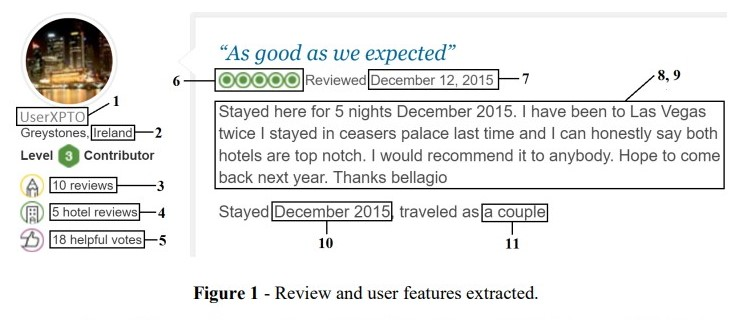

### Loading Dataset
#### This data set consists of reviews taken from all 21 hotels located on the Las Vegas Strip Avenue. Two reviews were selected per month from 2015 for all hotels for a total of 24 reviews per hotel which is 504 total reviews.
```{r}
hotel_review_df <- read.csv("LasVegasTripAdvisorReviews-Dataset.csv", sep = ";", header = TRUE)

View(hotel_review_df)
```



